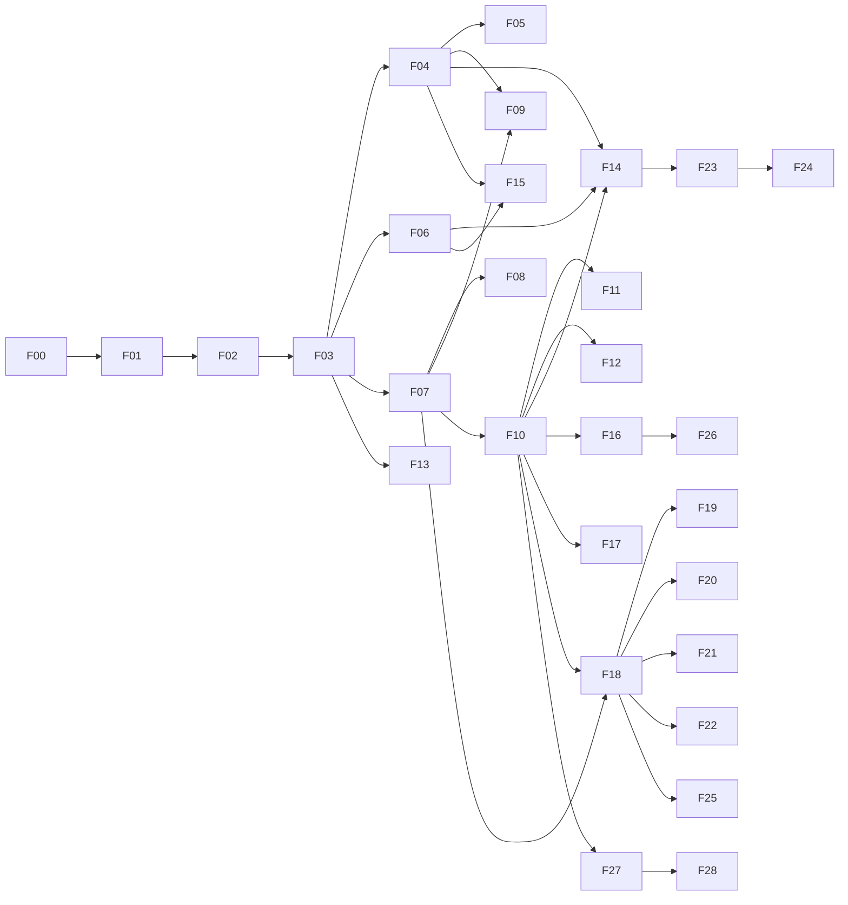

# fastapi-pilot — Implementation Plan

**Created:** 2026-10-03
**Scope:** All 33 user stories (US-01 – US-33) from the *Pilot User Stories* research and all defects (D1 – D15) from the *System Design* review.
**Rule:** one feature per branch, merged to `develop` before the next one starts.

---

## How to read this plan

Each feature (`F01` … `F28`) is a single branch and a single merge. For each one, the plan lists:

- **Stories / defects** — what it closes.
- **Depends on** — features that must be merged first.
- **Size** — S (≤ 1 day), M (2–3 days), L (about a week).
- **Changes** — the files that move.
- **Steps** — the order to do the work in.
- **Tests** — what proves it works.
- **Done when** — the acceptance check.

There are 28 features in 4 phases. Phase 1 finishes v0.2.0. That version is still unreleased (it's the uncommitted work on `develop`), and its release notes promise features that are currently broken.

| Phase | Version | Features | Goal |
|-------|---------|----------|------|
| 0 | — | F00 | Baseline the uncommitted work |
| 1 | v0.2.0 | F01 – F09 | Everything pilot already claims actually works |
| 2 | v0.3.0 | F10 – F17 | Project memory, auth, safer defaults, daily commands |
| 3 | v0.4.0 | F18 – F26 | Multiple templates, layout choice, AI / ML / worker |
| 4 | v0.5.0 | F27 – F28 | `pilot check`, `pilot upgrade` |

---

## Per-feature workflow (applies to every feature)

Follows the repo's existing git-flow conventions.

1. `git checkout develop && git pull && git checkout -b feature/fNN-short-name`
2. Write or adjust tests first:
   - unit tests in `tests/`
   - e2e cases in `tests/e2e/` once F02 exists
   - remove the `xfail` marker for every defect the feature fixes
3. Implement, committing in conventional style (`feat:`, `fix:`, `test:`, `refactor:`, `docs:`, `chore:`).
4. Run the gates locally:
   ```bash
   uv run ruff format --check .
   uv run ruff check .
   uv run mypy src/fastapi_pilot
   uv run pytest                 # fast unit suite
   uv run pytest -m e2e          # generated-project suite (from F02 on)
   ```
5. Update `CHANGELOG.md` under `[Unreleased]`. Update `README.md` if the change is user-facing, and the feature's status in `docs/ROADMAP.md`.
6. `git checkout develop && git merge --no-ff feature/fNN-short-name -m "merge: <description>"`

**Definition of done:** all gates are green, no new `xfail`, CHANGELOG updated, and every story the feature lists meets its acceptance criteria from the user stories document.

---

## Dependency graph



---

## Phase 0 — Baseline

### F00 · Commit the v0.2.0 work in progress

- **Stories / defects:** none (bookkeeping)
- **Size:** S

The `add`, `db`, docker and validation work is still uncommitted on `develop`. Every later feature needs a clean diff to compare against.

**Steps**
1. `git checkout -b feature/v0.2.0-baseline`
2. Commit in logical pieces:
   - `feat: pilot add command`
   - `feat: pilot db command`
   - `feat: docker addon`
   - `feat: project name validation`
   - `docs: roadmap and v0.2.0 notes`
3. Merge with `merge: v0.2.0 baseline (add, db, docker)`.

**Done when:** `git status` on `develop` is clean.

---

## Phase 1 — Make v0.2.0 true (F01 – F09)

### F01 · Repo hygiene and test controls

- **Stories / defects:** D6, D15; prerequisite for US-01 and US-33
- **Depends on:** F00
- **Size:** S

**Why first:** the unit tests call the real `pilot new`, which runs `uv sync` and `git`. Today the install fails quickly (D1). Once F03 fixes it, every test would install dependencies over the network. Post-generation steps need a switch before that happens.

**Changes**
- `src/fastapi_pilot/commands/new.py`, `core/generator.py`: add `--no-install` and `--no-git` options (default off). Pass them through to `generate_project()`.
- `tests/conftest.py`: an autouse fixture sets `PILOT_SKIP_POST_GEN=1`, which the generator also honours. Existing tests don't need to change.
- `src/fastapi_pilot/__init__.py`: `__version__ = importlib.metadata.version("fastapi-pilot")`, so the version lives in one place.
- `CHANGELOG.md`: move `[Unreleased]` above `[0.2.0]`.
- `pyproject.toml`: drop `tomli-w`. Reading TOML uses stdlib `tomllib`, and no planned feature needs to write TOML.
- Run `uv run ruff format .` on the 6 unformatted files.

**Tests**
- A unit test asserts that `--no-install` and `--no-git` skip the subprocess calls (patch `subprocess.run`).
- A version test asserts that `pilot --version` matches the package metadata.

**Done when:** all CI jobs are green, including `ruff format --check`, and the unit suite starts no subprocesses.

---

### F02 · Generated-project test harness

- **Stories / defects:** US-33
- **Depends on:** F01
- **Size:** M

**Why now:** this is the safety net for every later feature. It lands with the known defects marked `xfail(strict=True)`, so each fix has to remove its marker.

**Changes**
- `tests/e2e/conftest.py`:
  - a `generated_project(db, pm, addons)` fixture that runs `pilot new` *with* install into `tmp_path`
  - helpers `run_in(project, *cmd)` and `smoke(project, prefix)`
- `tests/e2e/smoke.py`: the HTTP create-then-read script used during the review. It creates tables, POSTs a record, reads it back, and checks that a missing ID returns 404.
- `tests/e2e/test_generated_projects.py`: a matrix of `db ∈ {sqlite, none, postgresql}` × these steps:
  1. `install` — `uv sync` exits 0
  2. `lint` — `ruff check .`
  3. `types` — `mypy app`
  4. `unit` — `pytest` inside the project
  5. `add-route` — `pilot add route widgets`, then `import app.main`
  6. `smoke` — create, then read back
  7. `migrate` — sqlite only: `pilot db migrate` yields at least one `create_table`
- `pyproject.toml`:
  - register the marker: `markers = ["e2e: generates and runs real projects"]`
  - add `addopts = "-m 'not e2e'"` so the default `pytest` stays fast
- `.github/workflows/ci.yml`:
  - replace the `template-test` job with an `e2e` job
  - matrix over `db`
  - a `postgres:16` service container for the PostgreSQL leg
  - run `uv run pytest -m e2e -k <db>`

**Initial xfail map**

| Step | xfail reason |
|------|--------------|
| install | D1 |
| lint, types | D5 |
| add-route (sqlite, postgresql) | D2 |
| smoke (none) | D4 |
| migrate | D3 |

**Done when:**
- `pytest -m e2e` runs locally for sqlite and none, and in CI for PostgreSQL.
- Every currently broken step is `xfail(strict=True)` with a defect ID.

---

### F03 · Generated project installs and passes its own lint

- **Stories / defects:** US-01; D1, D5, D14
- **Depends on:** F02
- **Size:** M

**Changes**
- `templates/standard/pyproject.toml.jinja`:
  - add `[tool.hatch.build.targets.wheel] packages = ["app"]`
  - add mypy settings for tests (`[[tool.mypy.overrides]]` for `tests.*` if needed)
- Add `templates/standard/app/py.typed`. This removes mypy's `import-untyped` error on the project's own modules.
- Add a final newline to every template that lacks one (W292). `router.py.jinja`, `database.py.jinja`, `env.py.jinja`, `main.py.jinja`, `logging.py.jinja`, `conftest.py.jinja` and `dependencies/database.py.jinja` are known; run `ruff` on a generated project to find the rest.
- `main.py.jinja`: fix import order (`collections.abc` before `contextlib`).
- `core/security.py`: type `dict` as `dict[str, Any]`.
- `components/*.jinja`:
  - switch to `Annotated[AsyncSession, Depends(get_db)]`, the current FastAPI style; this removes B008 without config hacks
  - wrap lines at 88 characters
  - remove the unused `Column` import
  - use `Mapped[datetime]` for timestamp columns
  - use `dict[str, Any]` in repositories
- Remove stale comments about `pilot generate route`, `pilot add auth-jwt` and "use `pilot add` to set up a database". Replace them with accurate text or delete them. F14 rewrites the auth stub.
- `core/generator.py`: when the install fails, print the last 20 lines of the tool's stderr and the exact command to rerun. This covers part of US-05.

**Tests**
- e2e: remove the xfail on `install`, `lint` and `types` for all DB variants.
- Unit: a rendered `pyproject.toml` contains the hatch packages entry.

**Done when:** a fresh project for each DB passes `uv sync`, `ruff check .`, `mypy app` and `pytest` with zero errors.

---

### F04 · `pilot add route` produces a working feature

- **Stories / defects:** US-07, part of US-12; D2, D3, D4
- **Depends on:** F03
- **Size:** M

**Changes**
- New `core/markers.py` — a shared helper for marker-delimited edits:
  - `insert_before_marker(path, marker, line, *, unique_key)`
  - `has_entry(path, regex)`

  `_register_route` moves onto this helper. F14 and F18 reuse it.
- `templates/standard/app/models/__init__.py`: add a `# --- pilot:models ---` marker block.
- `commands/add.py`:
  - when `has_db`, `route` generates `model, schema, repository, service, route`
  - after writing a model (from `add route` or `add model`), register `from app.models.<name> import <Class>  # noqa: F401` in `models/__init__.py`
- `components/repository.py.jinja`, no-DB branch: keep the store at module level (`_items: dict[int, dict[str, Any]]` and a counter) so data persists across requests.

**Tests**
- Unit:
  - `add route` with a DB creates 5 files
  - `models/__init__.py` contains the import
  - running the command twice doesn't duplicate the import
- e2e: remove the xfail on `add-route`, `smoke` and `migrate`.

**Done when:**
- For each DB, `pilot add route widgets` gives an app that imports, and the smoke test passes.
- On SQLite, `pilot db migrate` creates the `widgets` table.

---

### F05 · Name collision and duplicate detection

- **Stories / defects:** US-08; D7, D9
- **Depends on:** F04
- **Size:** S

**Changes**
- `commands/add.py`:
  - **Validate everything before writing anything.** Compute every target path, and reject the command if:
    - another module already defines the same class name (search `app/models/*.py` and `app/schemas/*.py` for `class <Class>(`), or
    - the same `__tablename__` exists, or
    - the same route prefix exists (`prefix="/<plural>"` in `router.py`).
  - **Exact duplicate check:** match `^from app\.routes\.<name> import` with a regex instead of a substring.
  - **Reserved names:** `health`, `router`, `main`, `core`, `api` (plus Python keywords, already handled).
- **Exit behaviour:** exit with code 1, a message naming the existing file, and a suggested alternative name.

**Tests**
- `add route post` after `add route posts` → exit code 1, and no files written.
- `add route user` after `add route users` → allowed only if the class and table differ. Under the singular rule, `users` already uses class `User`, so this is rejected with a clear message.
- `add route health` → rejected.

**Done when:** the D7 and D9 reproductions fail cleanly, with no partial writes.

---

### F06 · Safe async test setup in generated projects

- **Stories / defects:** US-16 (and the conftest finding that `make test` drops dev tables)
- **Depends on:** F03
- **Size:** M

**Changes**
- `config.py.jinja`: add `TEST_DATABASE_URL`:
  - SQLite: `sqlite+aiosqlite:///:memory:`
  - PostgreSQL: `.../<slug>_test`
- `.env.example.jinja`: document `TEST_DATABASE_URL`.
- `tests/conftest.py.jinja`, rewritten:
  - a session-scoped test engine built from `TEST_DATABASE_URL`
  - `create_all` once per session
  - per test: a connection with an outer transaction and a session bound to it; roll back after the test
  - override `get_db` through `app.dependency_overrides`
  - the `client` fixture uses the overridden app
- `pyproject.toml.jinja`, under `[tool.pytest.ini_options]`:
  - `asyncio_default_fixture_loop_scope = "session"`
  - `asyncio_default_test_loop_scope = "session"` (needs a pytest-asyncio version that supports it)
- Bump `pytest-asyncio` to that version.
- Add `tests/routes/test_health.py` to the template, so a fresh project has at least one passing test.

**Tests**
- e2e on SQLite: create a dev DB file with a sentinel table, run the project's `pytest`, and assert the sentinel table still exists.
- e2e: the project's `pytest` passes for each DB.

**Done when:** a generated project's tests never touch `DATABASE_URL`, and no "attached to a different loop" errors appear.

---

### F07 · Unified renderer and transactional generation

- **Stories / defects:** US-05; D8; removes the duplicate walkers
- **Depends on:** F03
- **Size:** M

**Changes**
- New `core/render.py`:
  ```python
  def render_tree(src: Path, dest: Path, context: Mapping[str, object],
                  *, rename: Mapping[str, str] = RENAME_MAP,
                  skip: Callable[[Path, Mapping], bool] | None = None) -> list[Path]
  def render_file(template_dir: Path, name: str, context: Mapping[str, object]) -> str
  ```
  It replaces `generator._render_template`, `new._generate_addons` and `add._render_component`, and supports conditional skips (used by F09).
- Use `to_slug()` everywhere a slug is computed (in `generator.py` and `new.py`).
- `core/generator.py`, new order:
  1. Render the base template and addons into `tempfile.mkdtemp()`.
  2. Move the result to the target, or merge it when `--force` is given.
  3. Install.
  4. `git init`, `add`, `commit` last.

  Any exception before the success message removes the target if pilot created it.
- `commands/new.py`: validate addons before printing the summary.
- Delete `templates/standard/copier.yml`, which is no longer read.

**Tests**
- Unit:
  - inject a template error → no target directory remains
  - `--with docker` → addon files are in the initial commit (`git status --porcelain` is empty)
- Unit: `render_tree` rename, skip and `.jinja` rules (moved from the generator tests).

**Done when:** one render path exists, and a generated project's `git status` is clean after `pilot new --with docker`.

---

### F08 · Working Docker addon

- **Stories / defects:** US-24; D10, D11
- **Depends on:** F07
- **Size:** M

**Changes**
- Rename `addons/docker/Dockerfile` to `Dockerfile.jinja`, with one branch per package manager:
  - **uv:**
    - `WORKDIR /app` in both stages, so the venv path doesn't change
    - `uv sync --frozen --no-dev --no-install-project`, then `uv sync --frozen --no-dev` after copying the source
  - **pip:** `pip install --prefix=/install .`, then copy `/install`
  - **poetry:** `poetry export` (or `poetry install --only main` in the venv), same `/app` path
  - runtime `CMD`: a single `uvicorn` process (F16 documents the choice of process model)
- `docker-compose.yml.jinja`:
  - add an anonymous volume `- /app/.venv`, so the bind mount doesn't hide the image's venv
  - when PostgreSQL is used, set `environment: DATABASE_URL: postgresql+asyncpg://postgres:postgres@db:5432/<slug>`, overriding `.env`
- Make sure `uv.lock` exists before the Docker build. F03's install now creates it; when the user passes `--no-install`, the README says to run `uv lock` first.

**Tests**
- Unit: rendered Dockerfile and compose content for each package manager and DB.
- CI-only e2e (`-m docker`):
  - `docker build` succeeds for uv, pip and poetry
  - `docker compose up -d` followed by `curl /api/v1/health` returns 200 for PostgreSQL

**Done when:** `docker compose up` serves `/docs` and connects to the DB service for a uv + PostgreSQL project.

---

### F09 · `pilot db` safety and `--db none` cleanup

- **Stories / defects:** US-13, US-15, rest of US-12; D12, D13
- **Depends on:** F04 (and F07 for skip rules)
- **Size:** S

**Changes**
- `commands/db.py`:
  - **`migrate`:** generate the revision only, then print its path and a count of `op.*` calls.
    - Warn and exit 1 when the count is 0: "no model changes detected — are your models imported in app/models/__init__.py?"
    - Apply only with `--apply`. This is a **behaviour change**; record it in the CHANGELOG.
  - **`reset`:** use `typer.confirm()` unless `--yes` is given.
  - **Runner fallback:** with no lockfile but a `.venv/bin/alembic` present, use it.
  - **Shared root lookup:** move `_find_project_root` into the shared helper. It becomes `core/project.py` in F10; until then, keep it in `core/markers.py` or a small `core/paths.py`.
- `core/render.py` skip rule: when `database == "none"`, skip `alembic.ini.jinja` and `migrations/`.
- `Makefile.jinja`: change `migrate` to `pilot db migrate --apply`, or keep raw Alembic for users without pilot. Decide and document.

**Tests**
- Unit:
  - patch `subprocess.run`
  - an empty migration exits 1 with the warning
  - `reset` without `--yes` aborts on "n"
  - `--db none` has no `alembic.ini`
- e2e: the `migrate` step uses `--apply`.

**Done when:** no `db` command can change the database without being explicit, and empty migrations are caught.

### Release v0.2.0

After F09, follow the repo's release flow:

1. Create `release/v0.2.0`.
2. Update `docs/RELEASE_v0.2.0.md`:
   - "5 files" for `add route`
   - the `migrate --apply` change
   - the new `--no-install` / `--no-git` flags
3. Merge to `main`, tag, and merge back to `develop`.

---

## Phase 2 — Project memory and daily essentials (F10 – F17) → v0.3.0

### F10 · `[tool.pilot]` metadata and a shared project context

- **Stories / defects:** US-03
- **Depends on:** F07
- **Size:** M

**Changes**
- `pyproject.toml.jinja`: add
  ```toml
  [tool.pilot]
  version = "{{ pilot_version }}"
  template = "standard"
  database = "{{ database }}"
  package_manager = "{{ package_manager }}"
  addons = [{{ addons | map('tojson') | join(', ') }}]
  ```
- New `core/project.py`:
  - `@dataclass(frozen=True) class ProjectContext` with fields `root`, `template`, `database`, `package_manager`, `addons`, `pilot_version`
  - `load_project(start: Path | None = None) -> ProjectContext`: walk up to the nearest `pyproject.toml` that has `[tool.pilot]`, using `tomllib`
  - **Fallback for v0.1/v0.2 projects:** infer the fields with today's heuristics, and print a hint to run `pilot check --fix-metadata` (F27)
- `commands/add.py` and `commands/db.py`: replace both `_find_project_root` copies and `_detect_database` with `load_project()`.
- `db` uses `ctx.package_manager` for the runner instead of guessing from lockfiles.

**Tests**
- Unit:
  - load from a nested directory
  - missing table → fallback
  - `add` in a `database = "none"` project generates the in-memory repository even if `database.py` mentions "Base"

**Done when:** no command reads file contents to guess configuration.

---

### F11 · User defaults file

- **Stories / defects:** US-04
- **Depends on:** F10
- **Size:** S

**Changes**
- New `core/user_config.py`: read `~/.config/pilot/config.toml`, or `$PILOT_CONFIG` when set, with `tomllib`. Keys:
  ```toml
  [defaults]
  author_name = "..."
  author_email = "..."
  database = "postgresql"
  package_manager = "uv"
  addons = ["docker"]
  ```
- `commands/new.py`, precedence: CLI flag, then user config, then built-in default. Author fields flow into `template_data`, replacing the hardcoded "Developer".
- `pilot config path` prints the resolved file location. `pilot config show` prints the effective defaults.

**Tests**
- Unit, using a `PILOT_CONFIG` temp file:
  - precedence
  - an invalid value gives a clear error naming the key

**Done when:** a configured user can run `pilot new x --ni` and get their author, DB and package manager without passing flags.

---

### F12 · Settings hardening

- **Stories / defects:** US-09, US-20
- **Depends on:** F10
- **Size:** S

**Changes**
- `config.py.jinja`:
  - add `ENVIRONMENT: Literal["development", "test", "production"] = "development"`
  - `SECRET_KEY` has no default
  - a `model_validator` rejects a missing or placeholder `SECRET_KEY`, or one shorter than 32 characters, when `ENVIRONMENT == "production"`
  - group settings into nested models (`DatabaseSettings`, `SecuritySettings`) using `env_nested_delimiter="__"`, or keep them flat and only document the grouping. Decide in the PR; flat with comments is acceptable.
- `.env.jinja`: generate a random `SECRET_KEY` at creation (`secrets.token_urlsafe(48)` passed as template data).
- `.env.example.jinja`: list every field.

**Tests**
- e2e: start the app with `ENVIRONMENT=production` and the placeholder key → startup fails with a clear message.
- Unit: a meta-test asserts every `Settings` field appears in `.env.example`. F27 reuses this check.

**Done when:** a generated project can't run in production with a placeholder secret, and each project gets its own key.

---

### F13 · README that teaches the structure

- **Stories / defects:** US-02
- **Depends on:** F03
- **Size:** S

**Changes**
- `README.md.jinja`, new sections:
  - "How a request flows": the routes → services → repositories → models chain, plus where `get_db` and exceptions fit
  - "Where new code goes": a table from folder to responsibility to pilot command
  - "Commands": `make` targets and `pilot add` / `pilot db`
  - per-addon sections rendered conditionally

**Tests:** unit snapshot test of the rendered README for each DB.

**Done when:** someone new can find where to put a new endpoint without opening any other file.

---

### F14 · `--with auth` addon (and addon manifests)

- **Stories / defects:** US-19, US-21
- **Depends on:** F04, F06, F10
- **Size:** L

This is the first addon that edits existing files, so it introduces **addon manifests**.

**Changes — engine**
- `templates/addons/<name>/addon.toml`:
  ```toml
  requires_db = true
  requires = []            # other addons
  dependencies = []        # extra pyproject deps
  [[register_route]]
  module = "auth"  prefix = "/auth"  tags = ["auth"]
  [[register_model]]
  module = "user"  classes = ["User", "RefreshToken"]
  ```
- New `core/addons.py`:
  - load manifests
  - validate `requires_db` and `requires` (error before rendering)
  - render the files, then apply registrations through `core/markers.py`
  - append the addon to `[tool.pilot].addons`
- `pilot new --with auth` uses this path. A follow-up command, `pilot add addon auth`, can come later with the same code.

**Changes — generated code** (`addons/auth/`)
- `app/models/user.py`: `User` (email unique, hashed_password, role, is_active, timestamps) and `RefreshToken` (jti, user_id, expires_at, revoked_at).
- `app/schemas/auth.py`: `RegisterIn`, `LoginIn`, `TokenPair`, `UserRead`.
- `app/repositories/user.py`, `app/services/auth.py`:
  - register
  - authenticate
  - issue a token pair
  - rotate the refresh token: revoke the old jti and issue a new one; reuse of a revoked token revokes the whole family
- `app/routes/auth.py`: `POST /auth/register`, `POST /auth/login`, `POST /auth/refresh`, `POST /auth/logout`, `GET /auth/me`.
- `app/dependencies/auth.py`, replacing the stub:
  - `get_current_user` (OAuth2PasswordBearer)
  - `require_role(*roles)`
- `app/core/security.py`: reuse the existing bcrypt and PyJWT helpers; add the `jti` and `type` claims.
- `tests/routes/test_auth.py`:
  - register, then login, then `/me`
  - wrong password → 401
  - expired access token → 401
  - refresh rotation
  - reuse of a revoked refresh token → 401
  - `require_role` denied → 403

**Tests**
- e2e: a new matrix entry `addons=["auth"]` for sqlite and postgresql runs the project's tests.
- Unit: `--with auth --db none` → error before anything is written.

**Done when:** a generated project with auth passes its own auth tests and lint, and the old stub is gone.

---

### F15 · Generated tests for `pilot add route`

- **Stories / defects:** US-17
- **Depends on:** F04, F06
- **Size:** S

**Changes**
- New `components/test_route.py.jinja`:
  - create, list, get, update and delete
  - 404 on a missing ID
  - 422 on an invalid payload
- `commands/add.py`: `route` also writes `tests/routes/test_<name>.py`, skipped if it already exists.

**Tests:** e2e: after `add route widgets`, the project's `pytest` runs the new tests and they pass, for each DB.

**Done when:** every added route comes with passing tests.

---

### F16 · Readiness probe, request IDs, process model

- **Stories / defects:** US-25, part of US-26
- **Depends on:** F10
- **Size:** S

**Changes**
- `routes/health.py`:
  - keep `/health` for liveness
  - add `/ready`: runs `SELECT 1` through the engine when a DB is configured; returns 503 with a reason on failure
- New `middleware/request_id.py`:
  - read or create `X-Request-ID` and store it in a `contextvars.ContextVar`
  - add it to the response header
- `core/logging.py.jinja`: a logging filter injects `request_id` into every record. The format includes it.
- `README.md.jinja` deployment section:
  - one Uvicorn process per container on Kubernetes
  - `fastapi run --workers N` or `uvicorn --workers N` on a VM
  - follows the current FastAPI deployment docs

**Tests**
- Project tests: `/ready` returns 200; the `X-Request-ID` header is echoed back; a generated ID is present when none is sent.
- e2e: these run inside the generated project's suite.

**Done when:** an orchestrator can tell "up" from "ready", and logs from one request share an ID.

---

### F17 · `pilot run`

- **Stories / defects:** US-27
- **Depends on:** F10
- **Size:** S

**Changes**
- New `commands/run.py`. It builds the command from `ctx.package_manager`:
  - `uv run uvicorn app.main:app --reload --port {port} --host {host}`
  - or the poetry or bare equivalent
- Flags: `--port`, `--host`, `--no-reload`, `--workers` (implies `--no-reload`).
- Runs with `os.execvp`, so signals reach Uvicorn directly.

**Tests:** unit: patch `os.execvp` and assert the command for each package manager and flag combination.

**Done when:** `pilot run` starts the dev server from any subdirectory of a project.

### Release v0.3.0

---

## Phase 3 — Templates and options (F18 – F26) → v0.4.0

### F18 · Template engine: base layer + overlays + `--template`

- **Stories / defects:** prerequisite for US-28, US-29, US-30, US-06
- **Depends on:** F07, F10
- **Size:** L

**Changes**
- Restructure `templates/`:
  ```
  templates/
    _base/           # shared by every template: pyproject, Makefile, .gitignore, .env*,
                     # app/main.py, app/routes/{router,health}.py, core/logging, tests/conftest
    standard/        # overlay: services/, repositories/, models/, migrations/, core/database...
    components/
      standard/      # today's component templates
    addons/
  ```
- `core/render.py`: `render_project(template, ctx)` renders `_base`, then the template overlay (whose files replace base files of the same path), then the addons.
- `commands/new.py`: `--template` option, plus an interactive prompt listing `SUPPORTED_TEMPLATES`.
- `commands/add.py`:
  - pick components from `components/<ctx.template>/`
  - each template declares which component types it supports in `templates/<name>/template.toml`
  - unsupported types exit with a message
- e2e: add a `template` axis to the matrix.

**Tests**
- Unit: an overlay file wins over the base file.
- Unit: the rendered `standard` output is **byte-identical** to the pre-refactor output. Use a snapshot taken before the change; this proves the refactor changed nothing.

**Done when:** `standard` output is unchanged, and adding a template means adding a folder plus a `template.toml`.

---

### F19 · `minimal` template

- **Stories / defects:** US-30
- **Depends on:** F18
- **Size:** M

**Changes**
- `templates/minimal/`:
  - overrides `app/main.py` (no DB lifespan)
  - adds `app/config.py` (flat settings) and `app/schemas.py`
  - removes the DB settings
- `templates/minimal/template.toml`: `components = ["route"]`, `databases = ["none"]`. Passing `--db` with anything else is rejected.
- `components/minimal/route.py.jinja`: a single flat route file that registers itself in `router.py`.
- `/ready` returns 200 with no dependency checks.

**Tests:** e2e matrix entry `template=minimal`: install, lint, types, unit, add-route and smoke.

**Done when:** the generated project has fewer than 15 files and passes the full e2e pipeline.

---

### F20 · Layout choice: `--layout layered|domain`

- **Stories / defects:** US-06
- **Depends on:** F18
- **Size:** L

**Changes**
- `[tool.pilot].layout` in the metadata.
- **Domain layout:** `components/standard-domain/` renders `app/<name>/{router,schemas,service,repository,models,dependencies}.py`.
  - Routes register in `app/api.py` (the router aggregator).
  - Models register in `app/db/registry.py` (imported by `migrations/env.py`).
- `commands/add.py`: target paths come from a layout strategy object (`LayeredLayout`, `DomainLayout`) with these methods:
  - `paths_for(name) -> dict[str, Path]`
  - `route_registry()`
  - `model_registry()`
- `README.md.jinja`: describes whichever layout was generated.

**Tests**
- e2e entry `layout=domain` for sqlite: add-route, smoke and migrate.
- Unit: path mapping for each layout.

**Done when:** both layouts pass the same e2e steps, and `pilot add` follows the recorded layout.

---

### F21 · `ai` template

- **Stories / defects:** US-28, part of US-18
- **Depends on:** F18
- **Size:** L

**Before starting:** check the current SDK documentation for each provider offered. LLM SDK APIs and model names change often, so don't rely on older snippets.

**Changes** (`templates/ai/` overlay)
- `app/llm/client.py`: an `LLMClient` protocol with `complete(messages) -> Completion` and `stream(messages) -> AsyncIterator[Delta]`, plus a `Usage` dataclass.
- `app/llm/providers/<provider>.py`: only the provider chosen with `--llm` is rendered. `app/llm/fake.py` is always rendered.
- `app/llm/prompts/*.md` and `app/llm/prompts.py`: a loader by name.
- `app/rag/{ingest,retriever,vectorstore}.py`: `memory` by default; `pgvector` uses the PostgreSQL + Alembic path; `qdrant` later.
- `app/routes/chat.py`:
  - `POST /chat` (JSON)
  - `POST /chat/stream` (SSE through `StreamingResponse`, `text/event-stream`)
- `app/routes/documents.py`: `POST /documents` and `GET /documents`.
- `app/services/chat.py`: retrieve, then build the prompt, then call the LLM; logs token usage.
- Settings: `LLM_PROVIDER`, `LLM_MODEL` (required, no hardcoded default), `LLM_API_KEY`, `VECTOR_STORE`.
- `data/sample/` and `make ingest`.
- `tests/conftest.py` overrides the LLM dependency with `FakeLLM`.

**Tests**
- Project tests: the stream returns several SSE events ending with a done event; ingest followed by a query returns sample text; no network access (a socket guard fixture fails any outbound connection).
- e2e entry `template=ai`.

**Done when:** a fresh `ai` project runs fully offline with the fake provider, and switching provider is a settings change.

---

### F22 · `ml-serving` template

- **Stories / defects:** US-29, part of US-18
- **Depends on:** F18
- **Size:** M

**Changes** (`templates/ml-serving/` overlay)
- `--framework sklearn|onnx|torch`. `sklearn` is the first one implemented; the others can follow in later PRs.
- `app/ml/{loader,predictor,preprocessing}.py`:
  - load at lifespan startup into `app.state.predictor`
  - inference through `await run_in_threadpool(predictor.predict, batch)`
- `app/routes/predict.py`: `/predict` and `/predict/batch`, with a `MAX_BATCH_SIZE` limit.
- `app/routes/model_info.py`: name, version and input schema.
- `/ready`: returns 503 until the model is loaded.
- `artifacts/` (with `.gitkeep`; its contents are gitignored) and `scripts/train_dummy.py`, which writes a tiny sklearn model. Add a `make train-dummy` target.
- The `models/` folder name is not used, to avoid confusion with ORM models.

**Tests**
- Project tests: the fixture trains the dummy model into `tmp_path`; predict and batch work; an oversized batch gets 422; `/ready` returns 503 before load.
- A concurrency test: one slow prediction (a sleep inside the predictor) doesn't delay `/health`.

**Done when:** `make train-dummy && make run` serves predictions, and the concurrency test passes.

---

### F23 · `--with worker` addon (with shared Redis)

- **Stories / defects:** US-22
- **Depends on:** F14 (manifests)
- **Size:** M

**Changes**
- `addons/redis/`:
  - `app/core/redis.py`: a client created in the lifespan
  - `REDIS_URL` setting
  - compose `redis` service
  - manifest `dependencies = ["redis>=5"]`
- `addons/worker/` with `requires = ["redis"]`:
  - ARQ by default: async-native and light
  - `app/worker.py`: `WorkerSettings` and an example task
  - `app/services/tasks.py`: `enqueue()`
  - a `make worker` target and a compose `worker` service
  - `--with worker` can later take `--queue celery`; ARQ comes first
- `README.md.jinja`: a "Background work" section explaining when `BackgroundTasks` is enough and when to use the worker.

**Tests**
- Project test: enqueue, then run the task through ARQ's test helpers (or call the function directly with a fake context).
- e2e entry `addons=["worker"]` (CI has a Redis service).

**Done when:** a task enqueued from an endpoint survives an API restart and is processed by the worker.

---

### F24 · `--with websockets` addon

- **Stories / defects:** US-23
- **Depends on:** F23 (Redis)
- **Size:** M

**Changes**
- `addons/websockets/` with `requires = ["redis"]`:
  - `app/realtime/manager.py`: connection manager with Redis pub/sub fan-out
  - `app/routes/ws.py`: `/ws/{channel}`
  - registration in the router through the manifest

**Tests:** project test: the `TestClient` WebSocket connects, publishes, and receives the message (Redis faked with `fakeredis` or the CI service).

**Done when:** two clients on different workers receive the same broadcast. This is checked manually once and automated with two app instances in e2e.

---

### F25 · `--orm sqlmodel` option

- **Stories / defects:** US-14
- **Depends on:** F18
- **Size:** M

**Changes**
- `[tool.pilot].orm`.
- Under `components/standard/sqlmodel/`: model and schema merged into one `SQLModel` class with `table=True`, plus a separate `<Name>Read` and `<Name>Update`.
- `database.py.jinja` and `env.py.jinja`: branch on `orm` for the metadata source.
- Supported for the `standard` template only.

**Tests:** e2e entry `orm=sqlmodel` for sqlite: add-route, smoke and migrate.

**Done when:** both ORMs pass the same e2e steps.

---

### F26 · `--with otel` addon

- **Stories / defects:** rest of US-26
- **Depends on:** F16
- **Size:** S

**Changes**
- `addons/otel/`:
  - OpenTelemetry SDK setup in the lifespan
  - FastAPI, SQLAlchemy and httpx instrumentation
  - an OTLP exporter configured by `OTEL_EXPORTER_OTLP_ENDPOINT`
  - the request ID from F16 attached as a span attribute
- Manifest dependencies: the opentelemetry packages.

**Tests:** project test with an in-memory span exporter: a request produces a server span with a child DB span.

**Done when:** traces show up in a local collector (`docker compose` gains an optional `jaeger` service).

### Release v0.4.0

---

## Phase 4 — Daily driver (F27 – F28) → v0.5.0

### F27 · `pilot check`

- **Stories / defects:** US-31
- **Depends on:** F10
- **Size:** M

**Changes**
- New `commands/check.py`. Checks are pluggable functions returning `Finding(level, code, message, path, fix)`.

  | Code | Check |
  |------|-------|
  | `PC001` | `[tool.pilot]` missing (`--fix-metadata` writes it from inferred values) |
  | `PC002` | a route module that isn't registered in the router |
  | `PC003` | a model module that isn't imported in the model registry |
  | `PC004` | a `Settings` field missing from `.env.example`, or vice versa |
  | `PC005` | blocking calls inside `async def` (`time.sleep`, `requests.*`, sync `Session` use), found with an `ast` walk |
  | `PC006` | `SECRET_KEY` placeholder in `.env` |
  | `PC007` | missing `__init__.py` in an `app/` package |

- Output: a Rich table, plus `--json`. Exits 1 when there are any errors.

**Tests:** unit: one fixture project per finding; `--json` schema.

**Done when:** each reproduction from the defect register that's still possible through a manual edit is reported with a fix hint.

---

### F28 · `pilot upgrade`

- **Stories / defects:** US-32
- **Depends on:** F27 (and F10)
- **Size:** L

**Changes**
- At generation, write `.pilot/manifest.json`: for each file pilot generated, its path, the sha256 of the rendered content, and the pilot version. Committed with the project.
- `commands/upgrade.py`:
  1. Re-render the project's recorded template, addons and options with the **current** pilot into a temp dir.
  2. Compare each file:
     - **unchanged by the user** (hash equals the manifest): auto-update, after showing the diff
     - **changed by the user:** show a 3-way summary and write `<file>.pilot-new` next to it, never overwriting
     - **new in the template:** offer to add it
     - **removed from the template:** report only
  3. `--dry-run` by default; `--apply` writes.
  4. Update the manifest and `[tool.pilot].version`.

**Tests:** unit: generate with a fake "old" template, then upgrade with a changed template; cover user-edited, untouched, new and removed files.

**Done when:** a v0.3 project can be upgraded to v0.5 without losing user edits.

### Release v0.5.0

---

## Story coverage check

| Story | Feature | Story | Feature | Story | Feature |
|-------|---------|-------|---------|-------|---------|
| US-01 | F01, F03 | US-12 | F04, F09 | US-23 | F24 |
| US-02 | F13 | US-13 | F09 | US-24 | F08 |
| US-03 | F10 | US-14 | F25 | US-25 | F16 |
| US-04 | F11 | US-15 | F09 | US-26 | F16, F26 |
| US-05 | F03, F07 | US-16 | F06 | US-27 | F17 |
| US-06 | F20 | US-17 | F15 | US-28 | F21 |
| US-07 | F04 | US-18 | F21, F22 | US-29 | F22 |
| US-08 | F05 | US-19 | F14 | US-30 | F19 |
| US-09 | F12 | US-20 | F12 | US-31 | F27 |
| US-10 | guarded by F02 | US-21 | F14 | US-32 | F28 |
| US-11 | guarded by F02 | US-22 | F23 | US-33 | F02 |

| Defect | Feature | Defect | Feature |
|--------|---------|--------|---------|
| D1 | F03 | D9 | F05 |
| D2 | F04 | D10 | F08 |
| D3 | F04 | D11 | F08 |
| D4 | F04 | D12 | F09 |
| D5 | F03 | D13 | F09 |
| D6 | F01 | D14 | F03, F14 |
| D7 | F05 | D15 | F01 |
| D8 | F07 | conftest drops dev DB tables | F06 |

---

## Decisions to make before the phase that needs them

| When | Decision | Recommendation |
|------|----------|----------------|
| F09 | Should `make migrate` call `pilot db migrate --apply` or raw Alembic? | Raw Alembic, so generated projects don't require pilot to be installed |
| F12 | Nested settings models or a flat class with grouping comments? | Flat; nested env names (`DB__URL`) confuse beginners |
| F14 | Ship auth through `pilot new --with` only, or also `pilot add addon`? | `new --with` first; `add addon` once manifests are stable |
| F21 | Which LLM providers at launch? | One hosted provider plus the fake; add more on request |
| F23 | ARQ or Celery as the default queue? | ARQ (async-native, smaller); Celery as an option later |
| F28 | Commit `.pilot/manifest.json` to the project repo? | Yes; upgrades need it on every machine |
